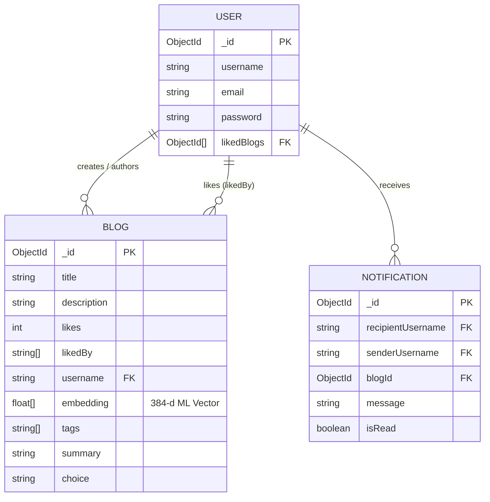

# BlogSphere — AI-Powered Collaborative Blogging Platform

BlogSphere is an ultra-modern, full-stack blogging and collaborative publication platform. Built with **React**, **Node.js (Express)**, **MongoDB**, and an **In-Process Machine Learning Engine (`@xenova/transformers`)**, BlogSphere combines rich-text blogging with real-time multi-user collaboration, semantic vector search, and AI-driven content recommendations.

---

## Table of Contents
1. [What BlogSphere Can Do](#what-blogsphere-can-do)
2. [Key Functionalities & Features](#key-functionalities--features)
3. [How the Backend Works](#how-the-backend-works)
4. [Database Schemas & Data Storage](#database-schemas--data-storage)
5. [Architecture Diagram](#architecture-diagram)
6. [How to Start the App Locally](#how-to-start-the-app-locally)
7. [Deployment Guide (Vercel & Render)](#deployment-guide-vercel--render)

---

## What BlogSphere Can Do

BlogSphere transforms traditional blogging into a smart, interactive publishing ecosystem:

* **Write & Collaborate**: Draft articles using a rich-text editor with real-time live collaboration (multi-user cursor editing via WebSockets and Yjs).
* **Discover Content via AI**: Search for articles conceptually using **384-dimensional Semantic AI Vector Search** (e.g., searching *"cloud infrastructure"* discovers articles about *"AWS and Docker"* even without keyword overlap).
* **Personalized Recommendations**: Discover articles in a tailored **"For You"** feed built by calculating vector similarities from your reading and liking history.
* **Auto AI Insights & Tagging**: Every published article is automatically analyzed to generate top topic hashtags (e.g., `#Artificial`, `#Database`) and an extractive 2-sentence summary.
* **Engage & Interact**: Single-like toggle enforcement per user, comment threads, author notifications, and a responsive contact support desk.

---

## Key Functionalities & Features

### 1. User Authentication & Account Security
* **JWT-Based Security**: JSON Web Tokens for stateless, secure session handling.
* **Password Encryption**: Password hashing using `bcrypt`.
* **Profile Stats**: Tracks user publications, total likes received, and liked reading list (`likedBlogs`).

### 2. Rich-Text & Live Collaborative Editor
* **TipTap Editor**: Full rich-text formatting (headings, code blocks, bold/italics, bullet lists).
* **Real-Time Collaboration**: Powered by `yjs` and `y-websocket` allowing multiple authors to edit the exact same document simultaneously with live cursor position indicators.

### 3. Native Machine Learning Core (`@xenova/transformers`)
* **In-Process ML Engine**: Uses `Xenova/all-MiniLM-L6-v2` ONNX model directly inside Node.js (no external Python server needed).
* **Semantic AI Search**: Computes Cosine Similarity between 384-d search query vectors and stored document vectors.
* **Extractive AI Summaries**: Uses sentence embedding similarity against document context to pick the top 2 most representative sentences.
* **Keyword Auto-Tagging**: Term frequency scoring with stopword removal and title weighting.

### 4. Single-Like per User System
* **1-Like Enforcer**: Users can only like a blog post **once**.
* **Toggle Like / Unlike**: Clicking the heart when already liked gracefully unlikes the post, decrements count, and removes it from the user's liked list.
* **Live Visual Feedback**: Red/rose filled heart indicator with interactive status feedback.

### 5. Support Desk & HTML Emailer
* **Nodemailer Integration**: Contact form submissions trigger custom-designed, email-client-safe luxury HTML emails sent directly to the support desk inbox.

---

## How the Backend Works

The backend is built as a **Node.js REST API service** using **Express v5** and **Mongoose v8**.

```
BlogSphere Project Structure
├── BlogBackend/
│   ├── Controllers/
│   │   ├── authControllers.js    # Auth, register, login, total users
│   │   ├── controllers.js        # Blog CRUD, Semantic Search, Recommendations, Likes
│   │   ├── mailController.js     # Contact form email logic
│   │   └── notificationController.js # Notifications API
│   ├── models/
│   │   ├── usermodel.js          # User schema
│   │   ├── blogmodel.js          # Blog schema with vector embeddings & likedBy
│   │   └── Notification.js       # Notification schema
│   ├── routes/
│   │   ├── auth.js               # /api/auth routes
│   │   ├── Blogs.js              # /api/blogs routes
│   │   ├── mail.js               # /api/contact route
│   │   └── notificationRoutes.js # /api/notifications routes
│   ├── services/
│   │   └── mlClient.js           # Native JS ML Service (@xenova/transformers)
│   └── server.js                 # Server entry point & DB connection
└── frontend/                     # React + Vite frontend application
```

### Request Flow Examples:
1. **Publishing a Blog**:
   `POST /api/blogs` -> `controllers.createBlog()` -> calls `mlClient.enrichBlog(title, description)` in-process -> generates 384-d `embedding`, `tags`, and `summary` -> saves to MongoDB -> returns new blog object.
2. **Semantic Searching**:
   `GET /api/blogs/search/semantic?query=...` -> converts query into a 384-float vector -> calculates Cosine Similarity against all blog embeddings in MongoDB -> sorts by similarity score -> returns top matches.
3. **Liking a Blog**:
   `PATCH /api/blogs/:id/like` -> checks if `username` exists in `blog.likedBy` -> toggles `$pull` (unlike) or `$addToSet` (like) -> updates `blog.likes` counter -> sends in-app notification to author -> returns updated blog.

---

## Database Schemas & Data Storage

Data is stored in **MongoDB Atlas** across three primary collections: `users`, `blogs`, and `notifications`.

### 1. `User` Schema (`users` collection)
| Field | Type | Description |
| :--- | :--- | :--- |
| `_id` | `ObjectId` | Auto-generated unique identifier |
| `username` | `String` | Unique handle of the user |
| `email` | `String` | Unique email address (lowercased) |
| `password` | `String` | Hashed password (`bcrypt`) |
| `likedBlogs` | `[ObjectId]` | References to `Blog` IDs liked by the user |

### 2. `Blog` Schema (`blogs` collection)
| Field | Type | Description |
| :--- | :--- | :--- |
| `_id` | `ObjectId` | Auto-generated unique blog ID |
| `title` | `String` | Blog title |
| `image` | `String` | Thumbnail image URL |
| `choice` | `String` | Visibility (`'public'` or `'private'`) |
| `description` | `String` | Rich-text HTML content |
| `likes` | `Number` | Total like count (default: 0) |
| `likedBy` | `[String]` | Array of usernames who liked this post |
| `author` | `String` | Display name of the author |
| `username` | `String` | Unique username of creator |
| `comments` | `[String]` | Array of comment strings |
| `collaborators`| `[String]` | Array of permitted collaborator usernames |
| `embedding` | `[Number]` | **384-dimensional vector float array** for ML search |
| `tags` | `[String]` | Auto-extracted keyword hashtags |
| `summary` | `String` | Extractive 2-sentence AI summary |
| `status` | `String` | Status (`'published'` / `'processing'`) |
| `createdAt` | `Date` | Timestamp |

### 3. `Notification` Schema (`notifications` collection)
| Field | Type | Description |
| :--- | :--- | :--- |
| `recipientUsername` | `String` | Target user receiving notification |
| `senderUsername` | `String` | User triggering notification |
| `blogId` | `ObjectId` | Associated blog post |
| `blogTitle` | `String` | Title snippet |
| `message` | `String` | Notification text |
| `isRead` | `Boolean` | Read status |

---

## Architecture Diagram



---

## How to Start the App Locally

### Prerequisites
* **Node.js** (v18 or higher)
* **npm**
* **MongoDB Atlas** account (or local MongoDB connection string)

### 1. Environment Configuration

Create a `.env` file inside `BlogBackend/`:
```env
PORT=5000
MONG_URI=your_mongodb_atlas_connection_string
JWT_SECRET=your_jwt_super_secret_key
EMAIL_FROM=blogspherehelpdesk@gmail.com
EMAIL_PASS=your_google_app_password
```

Create a `.env` file inside `frontend/`:
```env
VITE_BASE_URL=http://localhost:5000
```

### 2. Install Dependencies & Start Services

#### Terminal 1 — Backend:
```bash
cd BlogBackend
npm install
npm run dev
```
*(The backend will load `@xenova/transformers` ONNX runtime and start on `http://localhost:5000`)*

#### Terminal 2 — Frontend:
```bash
cd frontend
npm install
npm run dev
```
*(The frontend will start on `http://localhost:5173`)*

---

## Deployment Guide (Vercel & Render)

### Deploying Backend to Render (Free)
1. Push project to **GitHub**.
2. Connect repo on **Render.com** -> **New Web Service**.
3. Set **Root Directory** to `BlogBackend`.
4. Build Command: `npm install` | Start Command: `node server.js`.
5. Add Environment Variables (`MONG_URI`, `JWT_SECRET`, `EMAIL_FROM`, `EMAIL_PASS`).

### Deploying Frontend to Vercel (Free)
1. Connect repo on **Vercel.com** -> Import Project.
2. Set **Root Directory** to `frontend`.
3. Add Environment Variable: `VITE_BASE_URL=https://your-backend.onrender.com`.
4. Click **Deploy**!
